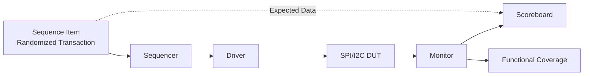
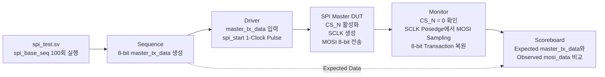
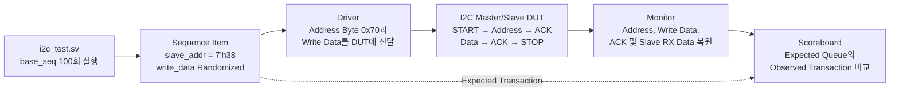

# SPI/I2C RTL Design & UVM Verification

SPI와 I2C Master/Slave RTL을 설계하고, UVM Environment와 FPGA Board-level Prototype을 통해 통신 동작을 검증한 프로젝트입니다.

RTL Simulation, UVM Randomized Verification, Functional Coverage, FPGA 보드 간 실제 통신까지 단계적으로 수행했습니다.

## Design Scope

### SPI

- Master/Slave FSM 구현
- TX/RX Shift Register 구성
- `CS_N`, `SCLK`, `MOSI`, `MISO` 신호 처리
- Master-to-Slave 및 Slave-to-Master 데이터 전송
- FPGA 보드 간 실제 SPI 통신

### I2C

- Master/Slave FSM 구현
- START와 STOP 조건 생성
- 7-bit Slave Address 처리
- Read/Write 구분
- Address/Data ACK·NACK 처리
- Open-Drain 방식의 SDA 제어
- FPGA 보드 간 실제 I2C 통신

> I2C RTL은 Read/Write 동작을 구현했으며, 현재 정리된 UVM Scenario는 Slave Address `0x38`에 대한 Write Transaction 검증을 중심으로 구성했습니다.

## UVM Environment

재사용 가능한 UVM Component를 이용하여 Stimulus 생성, DUT 구동, Protocol Monitoring, 자동 결과 비교 및 Functional Coverage 수집 환경을 구성했습니다.



### Components

- Sequence Item 및 Sequence
- Sequencer
- Driver
- Monitor
- Agent
- Scoreboard
- Functional Coverage Subscriber
- Environment 및 Test

## Structure

```text
rtl/i2c/
  I2C Master/Slave DUT

rtl/spi/
  SPI Master/Slave DUT

tb/i2c/
  I2C UVM Components

tb/spi/
  SPI UVM Components

fpga/
  Board-level Master/Slave Prototypes

scripts/
  VCS/Verdi Makefile and File List

docs/
  Editable Draw.io Diagrams
```

# SPI Verification

## SPI UVM Scenario

`spi_base_seq`를 100회 실행하면서 8-bit `master_tx_data`를 randomized하고, DUT가 MOSI로 전송한 값을 Monitor에서 복원해 Scoreboard로 비교합니다.



## SPI Automated Checks

| Verification Item | Method |
|---|---|
| Transaction Count | `spi_base_seq` 100회 실행 |
| Input Data | 8-bit `master_tx_data` randomized |
| Protocol Start | Driver에서 `spi_start` 1-Clock Pulse 발생 |
| Serial Transmission | `CS_N` 활성화 후 SCLK에 맞춰 MOSI 전송 |
| Monitor Sampling | SCLK Posedge에서 MOSI Sampling |
| Scoreboard | `master_tx_data`와 복원된 `mosi_data` 비교 |
| Coverage | 송신값·복원값의 Data Range와 Cross Coverage 수집 |

> 현재 SPI Scoreboard는 Master가 전송한 MOSI Data의 자동 비교를 수행합니다. MISO 경로는 Master/Slave Simulation Waveform과 FPGA 보드 간 통신으로 추가 확인했습니다.

## SPI Simulation Waveforms

<details>
<summary><strong>Master MOSI/MISO Waveform 보기</strong></summary>

### Master MOSI

`CS_N`이 Low로 활성화된 이후 Master가 SCLK를 생성하고, MOSI를 통해 8-bit Data를 순차적으로 전송하는 과정을 확인했습니다.


### Master MISO

Slave가 MISO로 전달한 데이터를 Master의 Sampling Edge에서 수신하고 RX Shift Register로 복원하는 과정을 확인했습니다.


</details>

<details>
<summary><strong>Slave MOSI/MISO Waveform 보기</strong></summary>

### Slave MOSI

Slave가 `CS_N`과 SCLK를 기준으로 MOSI를 Sampling하고, 수신한 Serial Data를 8-bit Data로 복원하는 과정을 확인했습니다.


### Slave MISO

Slave TX Data가 Shift Register를 통해 MISO로 출력되고, Master가 이를 수신하는 동작을 확인했습니다.


</details>

## SPI UVM Result and Coverage

<table>
<tr>
<th width="65%">Scoreboard Result</th>
<th width="35%">Functional Coverage</th>
</tr>
<tr>
<td>

</td>
<td>

</td>
</tr>
</table>

SPI Coverage는 다음 항목을 수집합니다.

- Monitor가 복원한 `mosi_data`의 Data Range
- Sequence에서 생성한 `master_tx_data`의 Data Range
- `master_tx_data × mosi_data` Cross Coverage

# I2C Verification

## I2C UVM Scenario

7-bit Slave Address를 `0x38`로 고정하고, 8-bit Write Data를 randomized하여 100회의 I2C Write Transaction을 수행합니다.

Slave Address `0x38`에 Write Bit `0`을 결합한 Address Byte는 `0x70`입니다.



## I2C Automated Checks

| Verification Item | Scoreboard Comparison |
|---|---|
| Transaction Count | `base_seq` 100회 실행 |
| Slave Address | `7'h38` |
| Write Address Byte | `8'h70` |
| Write Data | Randomized 8-bit Data |
| Address Check | `observed_addr_byte`와 Expected Address 비교 |
| Data Check | `observed_write_data`와 Expected Data 비교 |
| Slave Receive Check | `slave_rx_data`와 Expected Data 비교 |
| ACK Check | Address ACK와 Data ACK 확인 |
| Queue Check | 미검증 Expected Transaction 잔존 여부 확인 |

## I2C Functional Coverage

| Coverpoint | Coverage Target |
|---|---|
| `cp_addr` | Write Address Byte `0x70` 및 기타 Address |
| `cp_write_data` | `0x00`, Low, Mid, High, `0xFF` Data Range |
| `cp_addr_ack` | Address ACK/NACK |
| `cp_data_ack` | Data ACK/NACK |
| `cx_addr_data` | Address와 Write Data의 Cross Coverage |

정상 Write Scenario에서는 Address와 Data ACK를 기대하도록 Scoreboard를 구성했습니다. 따라서 NACK Bin 등 정상 전송에서 발생하지 않는 조건은 전체 Coverage가 100%에 도달하지 않는 원인이 될 수 있습니다.

## I2C UVM Result and Coverage

<table>
<tr>
<th width="65%">Scoreboard Result</th>
<th width="35%">Functional Coverage</th>
</tr>
<tr>
<td>

</td>
<td>

</td>
</tr>
</table>

# FPGA Prototype Verification

두 대의 Basys 3 보드를 Master와 Slave로 연결하여 RTL Simulation과 UVM에서 검증한 통신 동작을 실제 FPGA 환경에서 확인했습니다.

<table>
<tr>
<th width="50%">SPI Board-to-Board Communication</th>
<th width="50%">I2C Board-to-Board Communication</th>
</tr>
<tr>
<td>

</td>
<td>

</td>
</tr>
<tr>
<td>
Master에서 선택한 FND 자릿값과 데이터를 Slave로 전송하고, 여러 데이터가 순서대로 표시되는 것을 확인했습니다.
</td>
<td>
스위치 입력값 <code>1→3→7→15→63→127→255</code>를 I2C로 전송하고, Slave FND에 동일한 값이 표시되는 것을 확인했습니다.
</td>
</tr>
</table>

# Running the UVM Simulation

각 Makefile과 `filelist.f`는 정리된 Source 경로에 맞게 구성되어 있습니다.

## SPI

```bash
cd scripts/spi
make sim
```

## I2C

```bash
cd scripts/i2c
make sim
```

Synopsys VCS, Verdi 및 UVM 1.2를 사용할 수 있는 Linux 환경이 필요합니다.

# Original Artifacts

- [Vivado XPR 프로젝트 모음](./vivado/original-projects)
- [발표자료](./docs/presentation/260420_SPI_I2C_UVM_verification_장현동.pptx)
