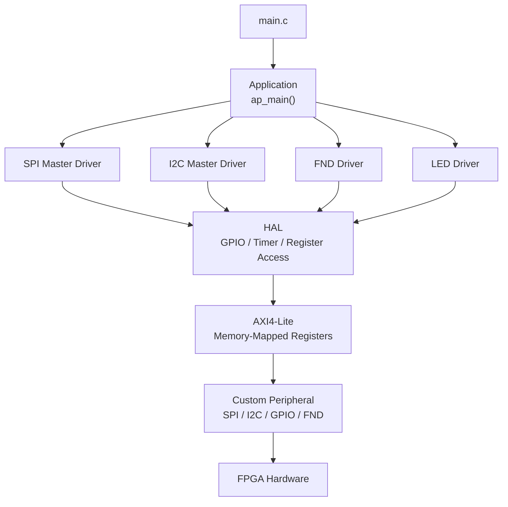
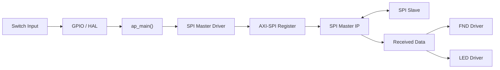
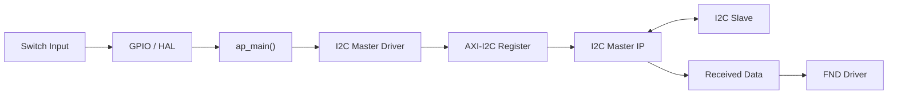
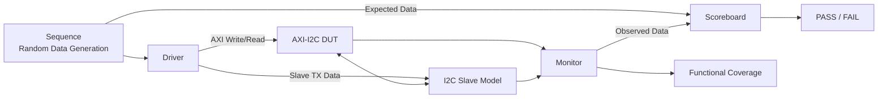

# AXI4-Lite SPI/I2C Peripheral SoC

MicroBlaze에서 AXI4-Lite Custom Peripheral을 제어하고, FPGA에서 SPI/I2C 통신을 확인한 HW/SW 통합 프로젝트입니다.

Vivado Block Design과 Custom RTL로 하드웨어 시스템을 구성하고, Vitis C Application을 Application·Driver·HAL 계층으로 분리했습니다. AXI-I2C Custom IP는 UVM 환경에서 AXI Write/Read 경로와 송수신 데이터 무결성을 검증했습니다.

## Project Highlights

- MicroBlaze 기반 AXI4-Lite SoC 구성
- AXI-SPI 및 AXI-I2C Master Custom Peripheral 연동
- Memory-Mapped Register 기반 주변장치 제어
- Application·Driver·HAL 계층으로 C 코드 분리
- FPGA Master/Slave 양방향 통신 확인
- AXI-I2C Write/Read 경로 UVM 검증
- Scoreboard 자동 비교 및 Functional Coverage 수집

## System Architecture

SPI와 I2C는 각각 별도의 Block Design 구성으로 구현했습니다.

<table>
  <tr>
    <th>MicroBlaze + AXI-SPI Master</th>
    <th>MicroBlaze + AXI-I2C Master</th>
  </tr>
  <tr>
    <td align="center">
      
    </td>
    <td align="center">
      
    </td>
  </tr>
  <tr>
    <td>
      MicroBlaze가 AXI4-Lite Register를 통해 SPI Master를 제어합니다.
    </td>
    <td>
      MicroBlaze가 AXI4-Lite Register를 통해 I2C Master의 송수신 동작을 제어합니다.
    </td>
  </tr>
</table>

- **UART**: 내부 동작 상태와 수신 데이터를 확인하기 위한 디버깅 출력
- **GPIO**: FPGA 스위치 입력을 읽고 Application에 전달
- **SPI/I2C Master**: AXI Register에 기록된 명령과 데이터를 실제 통신 신호로 변환
- **FND/LED**: 통신 결과와 입력 데이터를 FPGA 보드에서 확인

## Hardware/Software Control Flow



| 계층 | 주요 역할 |
|---|---|
| `main.c` | 시스템 초기화 후 `ap_main()` 호출 |
| Application | 전체 동작 순서와 송수신 데이터 흐름 관리 |
| Driver | SPI, I2C, FND, LED 등 기능 단위 제어 |
| HAL | GPIO, Timer 및 하드웨어 Register 접근 추상화 |
| AXI4-Lite Register | MicroBlaze와 Custom Peripheral 사이의 제어·데이터 전달 |
| Hardware | SPI/I2C 통신과 FPGA 입출력 수행 |

### SPI Software Flow



`ap_main()`에서 SPI Master 동작을 호출하고 송수신 흐름을 관리합니다. 수신 데이터는 FND 표시 형식으로 변환하며, 스위치 입력과 통신 결과는 LED 및 FND에서 확인할 수 있도록 구성했습니다.

### I2C Software Flow



`ap_main()`에서 I2C Master의 송수신 동작을 호출하고 데이터 흐름을 관리합니다. I2C에서 수신한 데이터는 FND Driver를 통해 표시 형식으로 변환한 뒤 GPIO Register에 기록합니다.

## Project Structure

```text
rtl/
├─ custom-ip/          custom AXI peripheral source
└─ uvm-design/         RTL used by the UVM environment

tb/
└─ uvm/                UVM agent, driver, monitor,
                       scoreboard and coverage

sw/
├─ ap/                 application control
├─ Driver/             FND, LED, Button, SPI and I2C drivers
├─ HAL/                GPIO and Timer abstraction
└─ main.c              software entry point

constraints/           Basys 3 XDC
scripts/uvm/           VCS/Verdi Makefile and file list
vivado/block-design/   design_1.bd and XCI metadata
vivado/ip-package/     custom IP packaging metadata
```

## AXI-I2C UVM Verification

현재 공개된 UVM Testbench는 **AXI-I2C Custom IP의 Write/Read 데이터 경로**를 중심으로 구성했습니다.

### Verification Scope

- AXI4-Lite Write/Read Transaction
- AXI Write Data와 I2C Slave 수신 데이터 비교
- I2C Slave 송신 데이터와 Master 수신 데이터 비교
- Scoreboard 기반 자동 PASS/FAIL 판정
- Expected/Observed Data Functional Coverage
- Write Path 및 Read Path Cross Coverage

### UVM Data Flow



| 검증 경로 | Expected Data | Observed Data | 비교 목적 |
|---|---|---|---|
| Write Path | AXI에 기록한 Write Data | I2C Slave가 수신한 Data | Master → Slave 전송 확인 |
| Read Path | Slave에 설정한 TX Data | I2C Master가 수신한 Data | Slave → Master 전송 확인 |

### UVM Verification Blocks

<table>
  <tr>
    <th>전체 검증 흐름</th>
    <th>Write Path</th>
    <th>Read Path</th>
  </tr>
  <tr>
    <td align="center">
      
    </td>
    <td align="center">
      
    </td>
    <td align="center">
      
    </td>
  </tr>
</table>

Sequence에서 Write Data를 Randomize하고 Driver가 AXI Register에 기록합니다. Monitor는 I2C Slave 수신 데이터와 Master 수신 데이터를 수집하며, Scoreboard는 각 경로의 Expected Data와 Observed Data를 비교합니다.

### Simulation Result

<details>
<summary><strong>UVM Transaction 중간 로그 보기</strong></summary>
<br>


Sequence에서 생성한 데이터와 Monitor가 관측한 데이터가 Scoreboard로 전달되는 과정을 확인할 수 있습니다.

</details>

<details>
<summary><strong>UVM 최종 결과 보기</strong></summary>
<br>


Simulation 종료 시 Write/Read 경로의 비교 결과와 PASS/ERROR Count를 확인합니다.

</details>

## Functional Coverage

다음 항목을 대상으로 Functional Coverage를 수집했습니다.

- Write Expected Data
- Read Expected Data
- Slave Received Data
- Master Received Data
- Write Expected/Observed Cross
- Read Expected/Observed Cross


### Data Range Coverage

0x00부터 0xFF까지 다양한 8-bit 데이터를 적용하여 특정 값에 편중되지 않도록 확인했습니다.

<table>
  <tr>
    <td align="center">
      
    </td>
    <td align="center">
      
    </td>
  </tr>
</table>

## FPGA Prototype

SPI와 I2C 모두 FPGA 보드에서 Master와 Slave 사이의 양방향 데이터 전송을 확인했습니다.

<table>
  <tr>
    <th>AXI-SPI FPGA 동작</th>
    <th>AXI-I2C FPGA 동작</th>
  </tr>
  <tr>
    <td align="center">
      
    </td>
    <td align="center">
      
    </td>
  </tr>
  <tr>
    <td>
      MicroBlaze가 AXI-SPI Register를 제어하고, FPGA 보드 간 SPI 송수신 결과를 LED와 FND에서 확인합니다.
    </td>
    <td>
      MicroBlaze가 AXI-I2C Register를 제어하고, Master/Slave 간 I2C 송수신 결과를 FPGA 보드에서 확인합니다.
    </td>
  </tr>
</table>

## Running the UVM Testbench

VCS와 UVM 1.2가 설치된 환경에서 실행합니다.

```bash
cd scripts/uvm
make sim
```

Verdi와 Coverage 결과는 다음 명령으로 확인할 수 있습니다.

```bash
make verdi
make vc
```

다른 Random Seed를 적용하려면 다음과 같이 실행합니다.

```bash
make SEED=<number> sim
```

## Reconstruction Note

대용량 BSP와 Vivado Generated Output은 저장소에서 제외했습니다.

Block Design과 XCI Metadata는 시스템 구조 확인을 위해 포함했지만, 다른 PC에서 프로젝트를 재구성할 때는 다음 항목을 확인해야 합니다.

- 원본 프로젝트와 호환되는 Vivado/Vitis 버전
- Custom IP Repository 경로
- Block Design의 IP 상태
- Source 및 Constraint 파일 경로
- BSP 및 Bitstream 재생성

## Original Artifacts

- [Primary Vivado XPR](<./vivado/original-project/20260502-microblaze-i2c-spi/20260502_MicroBlaze_I2C_SPI_Master.xpr>)
- [발표자료](<./docs/presentation/260508_SoC_AXI_Peripheral_장현동.pptx>)
- 같은 프로젝트 폴더의 `tmp_edit_project.xpr`는 Vivado가 생성한 임시 편집 프로젝트입니다.
