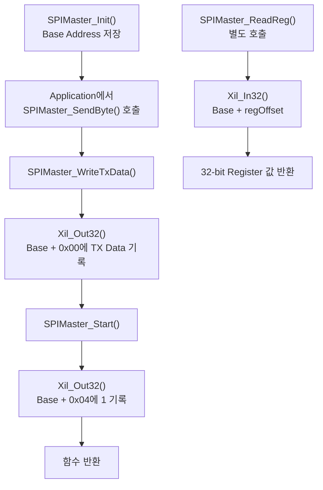
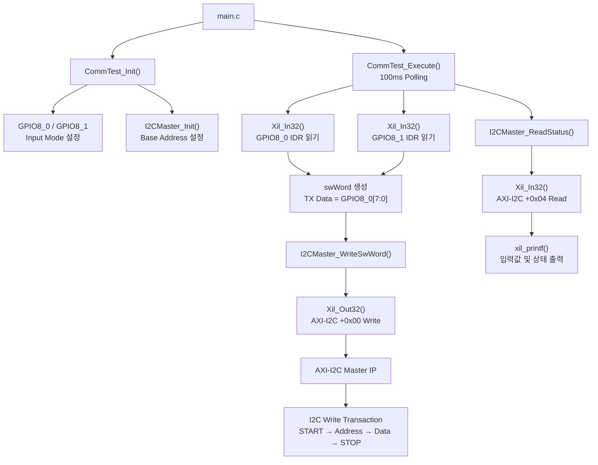
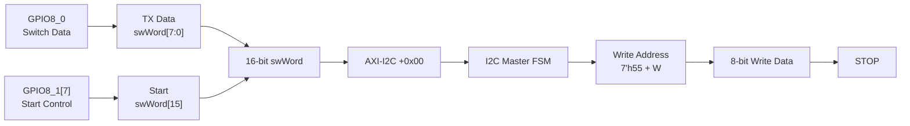
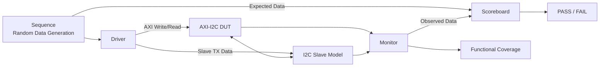

# AXI4-Lite SPI/I2C Peripheral SoC

MicroBlaze에서 AXI4-Lite Custom Peripheral을 제어하고, FPGA에서 SPI/I2C 통신을 확인한 HW/SW 통합 프로젝트입니다.

Vivado Block Design과 Custom RTL로 하드웨어 시스템을 구성했습니다. 현재 공개된 Vitis 실행 코드는 `CommTest` Application에서 GPIO 입력을 읽고 AXI-I2C Register에 제어값과 송신 데이터를 기록한 뒤, 상태 Register를 읽어 UART로 출력합니다.

SPI는 `SPIMaster` Driver의 송신 데이터 기록·시작 제어 흐름과 기존 FPGA 동작 자료를 정리했습니다. AXI-I2C Custom IP의 Write/Read 데이터 경로는 별도의 UVM 환경에서 검증했습니다.

## Project Highlights

- MicroBlaze 기반 AXI4-Lite SoC 구성
- AXI-SPI 및 AXI-I2C Master Custom Peripheral 구현
- Memory-Mapped Register 기반 주변장치 제어
- SPI Driver의 TX Data 기록 및 Start 제어 함수 구현
- GPIO 입력 기반 I2C Write Transaction 수행
- I2C 상태 Register의 FSM·Busy·Done·ACK 확인
- UART를 통한 GPIO 입력 및 I2C 상태 출력
- FPGA Master/Slave 통신 확인
- AXI-I2C Write/Read 경로 UVM 검증
- Scoreboard 자동 비교 및 Functional Coverage 수집

## System Architecture

SPI와 I2C는 각각 별도의 Block Design으로 구현했습니다. 현재 `main.c`에서 실행되는 Software Flow는 MicroBlaze, GPIO 2개와 AXI-I2C Master를 사용한 `CommTest` 구성입니다.

<table>
  <tr>
    <th>MicroBlaze + AXI-SPI Master</th>
    <th>MicroBlaze + AXI-I2C Master</th>
  </tr>
  <tr>
    <td align="center">
      
    </td>
    <td align="center">
      
    </td>
  </tr>
  <tr>
    <td>
      AXI-SPI Driver와 Custom IP를 이용한 SPI Master 구현 구성입니다.
    </td>
    <td>
      현재 Vitis 실행 코드와 연결된 AXI-I2C Master 및 GPIO 구성입니다.
    </td>
  </tr>
</table>

- **MicroBlaze**: Vitis C Application 실행 및 Memory-Mapped Register 접근
- **GPIO8_0**: I2C로 전송할 8-bit Switch Data 입력
- **GPIO8_1**: 상위 Bit를 이용한 I2C Transaction 시작 제어
- **AXI-I2C Master**: 제어값을 I2C START·Address·Write Data·STOP 신호로 변환
- **UART**: GPIO 입력값과 I2C 내부 상태를 디버깅 로그로 출력
- **FND**: I2C Custom IP가 전달받은 송신 데이터를 FPGA에서 표시

## AXI-SPI Software Interface

SPI Master Driver는 Base Address와 Register Offset을 이용해 송신 데이터 기록, 시작 제어 및 Register Read를 수행하도록 구성했습니다. [SPIMaster.c](./sw/Driver/SPIMaster/SPIMaster.c)와 [SPIMaster.h](./sw/Driver/SPIMaster/SPIMaster.h)에서 구현을 확인할 수 있습니다.

현재 공개된 `main.c`는 I2C `CommTest`를 실행합니다. 아래 SPI 흐름은 Application에서 `SPIMaster_SendByte()`를 호출했을 때 Driver가 수행하는 동작입니다.

### SPI RTL Files

[원본 20260415_spi](https://github.com/chieftain4202/UVM/tree/04901941bf19e7796409032831991b8cc1ed3664/Project_2/20260415_spi)의 RTL을 로직 변경 없이 정리했습니다.

| 파일 | 역할 |
|---|---|
| [SPI_master.sv](./rtl/spi/SPI_master.sv) | 송신 데이터 Shift, MISO 수신, SCLK 및 CS 제어 |
| [SPI_slave.sv](./rtl/spi/SPI_slave.sv) | MOSI 수신 및 수신 데이터의 후속 전송 Echo 처리 |
| [SPI_top.sv](./rtl/spi/SPI_top.sv) | Master·Slave·FND 연결과 버튼·스위치 제어 |
| [fnd_controller.sv](./rtl/spi/fnd_controller.sv) | 수신 데이터 저장 및 FND 표시 |

`SPI_top`은 일반 SPI 동작을 확인하는 독립 Top입니다. 이전 AXI-SPI 구현에 사용된 RTL과 동일한 버전인지는 확정하지 않았습니다. I2C 소스와 일부 모듈명이 겹치므로 별도 Source Set으로 사용합니다.

### SPI Driver Functions

| 함수 | 수행 동작 |
|---|---|
| `SPIMaster_Init()` | 전달받은 Base Address를 Driver Handle에 저장 |
| `SPIMaster_WriteTxData()` | 8-bit 송신 데이터를 32-bit 값으로 변환하여 `Base + 0x00`에 기록 |
| `SPIMaster_Start()` | `Base + 0x04`에 `1`을 기록하여 시작 제어 |
| `SPIMaster_SendByte()` | 송신 데이터 기록 후 시작 제어를 순서대로 수행 |
| `SPIMaster_ReadReg()` | 지정 Offset의 32-bit Register 값 반환 |

`SPIMaster_Init()`은 주소를 저장하는 함수이며, 하드웨어 Reset이나 SPI Mode 설정은 수행하지 않습니다. Register 접근에는 `Xil_Out32()`와 `Xil_In32()`를 직접 사용합니다.

### SPI Register Access Flow



`SPIMaster_SendByte()`는 다음 두 호출로 구성됩니다.

```c
void SPIMaster_SendByte(SPIMaster_t *hspi, u8 txData) {
    SPIMaster_WriteTxData(hspi, txData);
    SPIMaster_Start(hspi);
}
```

데이터를 먼저 기록한 뒤 시작 제어값을 기록합니다. 함수 내부에는 SPI 전송 완료 대기나 수신 데이터 비교가 없으므로, 함수 반환을 SPI 통신 완료로 해석하지 않습니다.

### SPI Register Access Map

아래 표는 공개된 C Driver의 접근 내용을 기준으로 정리했습니다.

| Offset | Driver 접근 | 코드에서 확인되는 용도 |
|---:|---|---|
| `+0x00` | `Xil_Out32()` | 8-bit TX Data 기록 |
| `+0x04` | `Xil_Out32()` | 시작 제어값 `1` 기록 |
| `+0x08` | Offset 상수 정의 | 전용 제어 함수에서 사용하지 않음 |
| `+0x0C` | Offset 상수 정의 | 전용 제어 함수에서 사용하지 않음 |
| 지정 Offset | `Xil_In32()` | `SPIMaster_ReadReg()`를 통한 Register Read |

SPI Base Address는 `SPIMaster_Init()`의 인자로 전달합니다. 위 Offset은 SPI 구성에 해당하며, 현재 I2C의 Address Map과 구분됩니다.

### SPI FPGA Integration

기존 AXI-SPI 구성에서는 MicroBlaze가 AXI Register를 통해 SPI Master를 제어하고, Master와 Slave 사이의 통신 동작을 FPGA 보드에서 확인했습니다. Block Design 이미지와 보드 동작 자료는 각각 System Architecture와 FPGA Prototype 항목에 수록했습니다.

`20260415_spi`의 일반 SPI RTL을 [`rtl/spi/`](./rtl/spi/)에 추가했습니다. SPI Driver는 [`sw/Driver/SPIMaster/`](./sw/Driver/SPIMaster/)에 있으며, 현재 공개 `design_1.bd`와 `main.c`는 I2C/GPIO 구성입니다. 가져온 SPI RTL에는 AXI Wrapper가 포함되어 있지 않으므로 AXI에 연결하려면 별도 Register Interface와 Block Design 연결이 필요합니다.

`SPIMaster_ReadReg()`는 범용 Register Read 함수입니다. 공개된 Driver만으로는 RX Data, Busy/Done Register 위치나 Start 자동 해제 여부를 확정할 수 없습니다. 이 저장소의 AXI UVM 결과는 별도 항목에 명시한 AXI-I2C 검증 결과입니다.

## Current I2C Hardware/Software Control Flow



## Current Software Call Sequence

| 순서 | 함수 및 모듈 | 동작 |
|---:|---|---|
| 1 | `main()` | `CommTest_Init()` 실행 후 `CommTest_Execute()` 반복 호출 |
| 2 | `CommTest_Init()` | GPIO 2개를 입력으로 설정하고 I2C Base Address 저장 |
| 3 | `CommTest_Execute()` | 100ms 주기로 GPIO 입력과 I2C 상태 확인 |
| 4 | `CommTest_ReadGpioInput()` | `Xil_In32()`로 GPIO Input Data Register 접근 |
| 5 | `I2CMaster_WriteSwWord()` | 제어값과 송신 데이터를 AXI-I2C `+0x00`에 기록 |
| 6 | AXI-I2C Master IP | START, Slave Address, Write Data, STOP 순서 수행 |
| 7 | `I2CMaster_ReadStatus()` | AXI-I2C `+0x04`에서 통신 상태 읽기 |
| 8 | `xil_printf()` | 입력 또는 상태가 변경된 경우 UART 로그 출력 |

## I2C CommTest Data Flow

GPIO 입력 2개를 이용해 I2C 송신 데이터와 시작 신호를 구성합니다.



`GPIO8_0`의 8-bit 입력은 I2C Write Data로 사용합니다. `GPIO8_1`의 상위 Bit는 `swWord[15]`에 배치되어 Transaction 시작을 제어합니다.

Application은 생성한 `swWord`를 I2C Driver에 전달하고, Driver는 `Xil_Out32()`를 사용해 AXI-I2C 제어 Register에 기록합니다. 이후 상태 Register를 읽어 FSM State, Busy, Done, ACK와 내부 송신 데이터를 확인합니다.

## Active Address Map

| Peripheral | Base Address | 현재 용도 |
|---|---:|---|
| AXI-I2C Master | `0x44A0_0000` | I2C 제어값 기록 및 상태 확인 |
| GPIO8_0 | `0x44A1_0000` | 8-bit I2C 송신 데이터 입력 |
| GPIO8_1 | `0x44A2_0000` | I2C 시작 신호 입력 |

## Active Register Map

### AXI-I2C Master

| Offset | 접근 | 기능 |
|---:|---|---|
| `+0x00` | Write | `swWord[15:0]` 제어값 및 송신 데이터 |
| `+0x04` | Read | I2C FSM과 통신 상태 |
| `+0x08` | Read/Write | Reserved Register |
| `+0x0C` | Read/Write | Reserved Register |

### I2C Status Register (`+0x04`)

| Bit | 필드 | 기능 |
|---:|---|---|
| `[3:0]` | State | I2C Master FSM 현재 상태 |
| `[4]` | Busy | I2C Transaction 진행 상태 |
| `[5]` | Done | 통신 단계 완료 감지 |
| `[6]` | ACK | Slave ACK/NACK 상태 |
| `[7]` | Start Level | 동기화된 Start 입력 상태 |
| `[8]` | Start Seen | Start 입력 감지 여부 |
| `[16:9]` | Switch TX Data | GPIO에서 전달된 송신 데이터 |
| `[24:17]` | Master TX Data | I2C Master가 현재 전송하는 데이터 |

### GPIO8

| Offset | 접근 | 기능 |
|---:|---|---|
| `+0x00` | Write | GPIO 방향 제어 Register |
| `+0x04` | Read | GPIO Input Data Register |
| `+0x08` | Write | GPIO Output Data Register |

현재 `CommTest_Init()`은 GPIO Control Register에 `0x00`을 기록해 GPIO8_0과 GPIO8_1을 입력으로 설정합니다.

## Additional Software Sources

저장소에는 현재 `CommTest` 실행 경로 외에도 SPI Master, FND, LED, Button, Timer Driver와 HAL 코드가 포함되어 있습니다.

현재 공개된 `main.c`는 다음 파일을 실행합니다.

```text
main.c
  └─ ap/CommTest/CommTest.c
       └─ Driver/I2CMaster/I2CMaster.c
```

다음 소스는 별도로 보존된 기능별 구현 자료이며 현재 `main.c`의 실행 경로에서는 호출되지 않습니다.

- `Driver/SPIMaster/`
- `Driver/FND/`
- `Driver/LED/`
- `Driver/Button/`
- `HAL/GPIO/`
- `HAL/TMR/`
- `ap/Clock/`
- `ap/TimeClock/`
- `ap/UpCounter/`
- `ap/ap_main.c`

## Project Structure

```text
rtl/
├─ custom-ip/          AXI-I2C 및 GPIO8 Custom IP
├─ spi/                20260415 SPI Master/Slave/Top/FND RTL
└─ uvm-design/         UVM 검증용 AXI-I2C RTL

tb/
└─ uvm/                Agent, Driver, Monitor,
                       Scoreboard 및 Coverage

sw/
├─ ap/
│  ├─ CommTest/        현재 main.c에서 실행하는 Application
│  ├─ Clock/           별도 Application Source
│  ├─ TimeClock/       별도 Application Source
│  └─ UpCounter/       별도 Application Source
├─ Driver/             I2C, SPI, FND, LED, Button Driver
├─ HAL/                GPIO 및 Timer HAL
└─ main.c              현재 Software Entry Point

constraints/           Basys 3 XDC
scripts/uvm/           VCS/Verdi Makefile 및 File List
vivado/block-design/   Block Design과 XCI Metadata
vivado/ip-package/     Custom IP Packaging Metadata
```

## AXI-I2C UVM Verification

현재 공개된 UVM Testbench는 보드에서 실행되는 `CommTest`와 분리된 검증 환경이며, `rtl/uvm-design`의 AXI-I2C Custom IP를 대상으로 Write/Read 데이터 경로를 검증합니다.

이 AXI 프로젝트의 UVM 코드·로그·Coverage 자료는 **AXI-I2C에 대한 결과**입니다. `rtl/spi/`에 추가한 SPI RTL은 해당 UVM 검증 대상에 포함되지 않습니다.

### Verification Scope

- AXI4-Lite Write/Read Transaction
- AXI Write Data와 I2C Slave 수신 데이터 비교
- I2C Slave 송신 데이터와 Master 수신 데이터 비교
- Scoreboard 기반 자동 PASS/FAIL 판정
- Expected/Observed Data Functional Coverage
- Write Path 및 Read Path Cross Coverage

### UVM Data Flow



| 검증 경로 | Expected Data | Observed Data | 비교 목적 |
|---|---|---|---|
| Write Path | AXI에 기록한 Write Data | I2C Slave가 수신한 Data | Master → Slave 전송 확인 |
| Read Path | Slave에 설정한 TX Data | I2C Master가 수신한 Data | Slave → Master 전송 확인 |

### UVM Verification Blocks

<table>
  <tr>
    <th>전체 검증 흐름</th>
    <th>Write Path</th>
    <th>Read Path</th>
  </tr>
  <tr>
    <td align="center">
      
    </td>
    <td align="center">
      
    </td>
    <td align="center">
      
    </td>
  </tr>
</table>

Sequence에서 Write Data와 Read Data를 생성하고, Driver가 AXI Register와 I2C Slave Model에 전달합니다. Monitor는 Slave 수신 데이터와 Master 수신 데이터를 수집하며, Scoreboard는 각 경로의 Expected Data와 Observed Data를 비교합니다.

### Simulation Result

<details>
<summary><strong>UVM Transaction 중간 로그 보기</strong></summary>
<br>


Sequence에서 생성한 데이터와 Monitor가 관측한 데이터가 Scoreboard로 전달되는 과정을 확인할 수 있습니다.

</details>

<details>
<summary><strong>UVM 최종 결과 보기</strong></summary>
<br>


Simulation 종료 시 Write/Read 경로의 비교 결과와 PASS/ERROR Count를 확인합니다.

</details>

## Functional Coverage

다음 항목을 대상으로 Functional Coverage를 수집했습니다.

- Write Expected Data
- Read Expected Data
- Slave Received Data
- Master Received Data
- Write Expected/Observed Cross
- Read Expected/Observed Cross


### Data Range Coverage

`0x00`부터 `0xFF`까지 다양한 8-bit 데이터를 적용하여 특정 값에 편중되지 않도록 확인했습니다.

<table>
  <tr>
    <td align="center">
      
    </td>
    <td align="center">
      
    </td>
  </tr>
</table>

## FPGA Prototype

SPI와 I2C는 각각의 FPGA 구성에서 Master와 Slave 사이의 데이터 전송을 확인했습니다. 현재 공개된 `main.c`의 실행 경로는 AXI-I2C와 GPIO를 사용하는 `CommTest` 구성입니다.

<table>
  <tr>
    <th>AXI-SPI FPGA 동작</th>
    <th>AXI-I2C FPGA 동작</th>
  </tr>
  <tr>
    <td align="center">
      
    </td>
    <td align="center">
      
    </td>
  </tr>
  <tr>
    <td>
      별도의 AXI-SPI 구성에서 MicroBlaze가 SPI Master Register를 제어하고, FPGA 보드 간 송수신 동작을 확인했습니다.
    </td>
    <td>
      현재 CommTest 구성에서 GPIO 입력값을 AXI-I2C Register에 기록하고, I2C Write Transaction과 상태 변화를 확인했습니다.
    </td>
  </tr>
</table>

## Running the UVM Testbench

Synopsys VCS와 UVM 1.2를 사용할 수 있는 Linux 환경에서 실행합니다.

```bash
cd scripts/uvm
make sim
```

Verdi와 Coverage 결과는 다음 명령으로 확인합니다.

```bash
make verdi
make vc
```

다른 Random Seed를 적용하려면 다음과 같이 실행합니다.

```bash
make SEED=<number> sim
```

## Reconstruction Note

대용량 BSP와 Vivado Generated Output은 저장소에서 제외했습니다.

Block Design과 XCI Metadata는 시스템 구조 확인을 위해 포함했지만, 다른 PC에서 프로젝트를 재구성할 때는 다음 항목을 확인해야 합니다.

- 원본 프로젝트와 호환되는 Vivado/Vitis 버전
- Custom IP Repository 경로
- Block Design의 IP 상태
- Source 및 Constraint 파일 경로
- BSP 및 Bitstream 재생성

## Original Artifacts

- [Primary Vivado XPR](<./vivado/original-project/20260502-microblaze-i2c-spi/20260502_MicroBlaze_I2C_SPI_Master.xpr>)
- [발표자료](<./docs/presentation/260508_SoC_AXI_Peripheral_장현동.pptx>)
- 같은 프로젝트 폴더의 `tmp_edit_project.xpr`는 Vivado가 생성한 임시 편집 프로젝트입니다.
