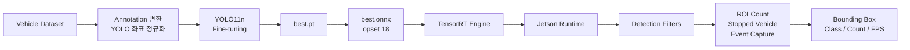
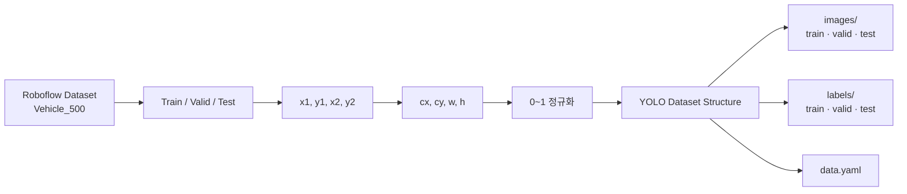
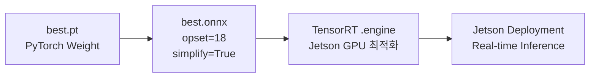
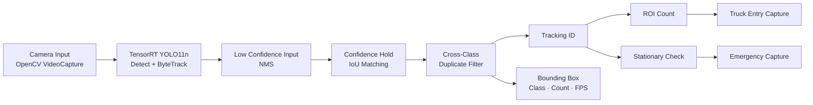
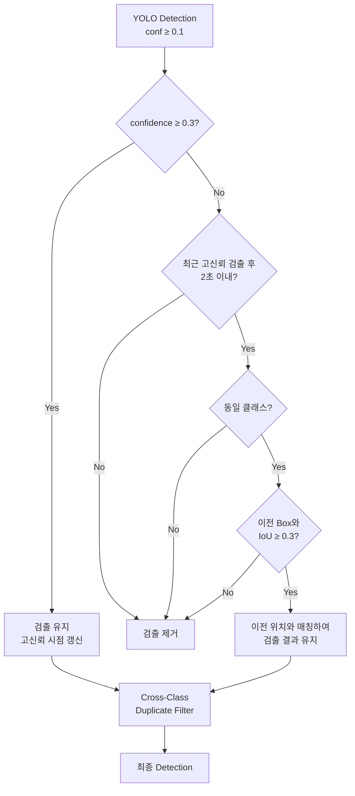
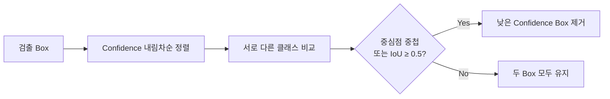

# YOLO Vehicle Detection on Jetson

YOLO11n으로 5종 차량을 학습하고 TensorRT Engine으로 변환하여 Jetson에서 실시간 추론한 Edge AI 팀 프로젝트입니다.

단순 Bounding Box 출력에서 확장하여 검출 흔들림을 줄이는 Confidence Hold Filter, 서로 다른 클래스의 중복 검출 제거, 사용자 지정 구역 차량 집계, Tracking 기반 정차 판정과 이벤트 이미지 저장 기능을 구현했습니다.

## Key Features

- Truck, Trailer, Bus, Car, Motorcycle 5종 차량 검출
- YOLO11n Fine-tuning 및 TensorRT Engine 변환
- ByteTrack 기반 프레임 간 차량 추적
- High/Low Confidence와 IoU를 이용한 검출 유지
- 서로 다른 클래스의 중복 Bounding Box 제거
- 4점 다각형 ROI 설정 및 차량 종류별 누적 집계
- Tracking ID 기반 중복 카운트 방지
- 일정 시간 움직임이 적은 차량의 정차 상태 판정
- 트럭 진입 및 정차 이벤트 자동 이미지 저장
- 검출 결과, 차량 수, FPS 실시간 표시

## End-to-End Pipeline



## Dataset Preparation

원본 Annotation을 YOLO 형식으로 변환하고, 이미지와 Label을 Train·Validation·Test 구조로 분리했습니다.



### Class Mapping

| Class ID | Label |
|---:|---|
| 0 | `truck` |
| 1 | `trailer` |
| 2 | `bus` |
| 3 | `car` |
| 4 | `motorcycle` |

## Model Training

YOLO11n 사전 학습 모델을 기반으로 5종 차량 데이터에 맞게 Fine-tuning했습니다.

| 항목 | 설정 |
|---|---|
| Base Model | `YOLO11n.pt` |
| Number of Classes | 5 |
| Epochs | 250 |
| Batch Size | 16 |
| Image Size | 640 |
| Rotation | `degrees=5.0` |
| Horizontal Flip | `fliplr=0.5` |
| Mosaic | `mosaic=1.0` |
| Output | `best.pt` |

학습 결과 중 검증 성능이 가장 좋은 Weight를 `best.pt`로 저장하고, Jetson 추론을 위해 ONNX와 TensorRT Engine으로 변환했습니다.

## TensorRT Deployment



TensorRT Engine은 생성한 GPU, CUDA, cuDNN, TensorRT 환경에 영향을 받습니다. 다른 Jetson 또는 GPU 환경에서는 ONNX 모델을 이용해 Engine을 다시 생성해야 할 수 있습니다.

## Runtime Architecture



### Runtime Configuration

| 항목 | 현재 최종 스크립트 설정 |
|---|---:|
| Camera Index | `0` |
| Requested Camera Size | `1000 × 720` |
| Model Input Size | `640` |
| Tracker | `ByteTrack` |
| Low Confidence | `0.1` |
| High Confidence | `0.3` |
| NMS IoU | `0.45` |
| Hold Time | `2 s` |
| Hold Matching IoU | `0.3` |
| Cross-Class IoU | `0.5` |

카메라 해상도는 실행 장치에 맞게 변경할 수 있으며, YOLO 추론 입력 크기는 `640`으로 설정했습니다.

## Detection Filter Pipeline



## Confidence Hold Filter

한 프레임에서 Confidence가 낮아졌다는 이유만으로 차량 Bounding Box가 즉시 사라지지 않도록 검출 결과를 일정 시간 유지합니다.

1. Confidence가 `0.3` 이상이면 고신뢰 검출로 유지합니다.
2. Confidence가 `0.1~0.3`이면 최근 고신뢰 검출 기록을 찾습니다.
3. 동일 클래스이고 이전 Box와 IoU가 `0.3` 이상인지 확인합니다.
4. 마지막 고신뢰 검출로부터 2초 이내라면 기존 차량으로 판단해 검출을 유지합니다.
5. 조건을 만족하지 않으면 해당 Box를 제거합니다.

이를 통해 일시적인 조명 변화나 일부 가림으로 Confidence가 낮아질 때 발생하는 Bounding Box 깜빡임을 줄였습니다.

## IoU Matching

IoU는 두 Bounding Box가 얼마나 겹치는지 나타내는 값으로, 이전 프레임의 차량과 현재 검출 차량을 비교하는 기준으로 사용했습니다.

```text
IoU = Intersection Area / Union Area
```

- `IoU = 0`: 두 Box가 겹치지 않음
- `IoU = 1`: 두 Box가 완전히 일치
- 값이 클수록 두 Box의 위치가 유사함

Confidence Hold에는 `0.3`, 서로 다른 클래스의 중복 검출 제거에는 `0.5`를 적용했습니다.

## Cross-Class Duplicate Filter

동일한 차량이 `car`, `truck`, `bus` 등 여러 클래스로 동시에 검출되는 문제를 후처리로 제거했습니다.



동일 위치에서 서로 다른 클래스로 판단된 Box만 비교하며, 중복 조건을 만족하면 Confidence가 가장 높은 클래스 하나를 유지합니다.

## Region-of-Interest Counting

실행 화면에서 마우스로 네 점을 클릭해 차량 집계 구역을 설정합니다.

- 네 점으로 다각형 ROI 생성
- Bounding Box 중심점이 ROI 내부인지 확인
- ByteTrack의 `track_id`를 기준으로 신규 진입 차량만 집계
- 동일 차량이 구역 안에 머무는 동안 중복 집계 방지
- 추적이 잠시 끊겨도 3초 동안 기존 Track 상태 유지
- Truck이 새로 진입하면 현재 화면을 자동 저장

### ROI and First-Lane Truck Detection


사용자가 지정한 차선 범위 안에 Bounding Box 중심점이 들어오면 해당 차량을 집계합니다. Track ID를 기준으로 처리하므로 같은 차량이 여러 프레임에서 반복 검출되더라도 한 번만 누적됩니다.

### Stopped-Vehicle Detection Test

Tracking ID별 차량 중심 좌표를 기록하고, 기준 위치에서 이동량이 20px 이하인 상태가 5초 이상 지속되면 정차 이벤트로 판정합니다.

| 검증 항목 | 적용 기준 |
|---|---:|
| 정차 유지 시간 | 5초 이상 |
| 허용 이동 범위 | 기준점으로부터 20px 이하 |
| Track 유지 시간 | 5초 |
| 정체 예외 조건 | 화면 내 차량 8대 이상 |

> 시연에서는 정차 상황을 재현하기 위해 입력 영상을 일시정지했습니다. 이는 정차 판정 로직의 동작을 확인하기 위한 테스트이며, 실제 도로 환경에서의 불법 주정차 판정을 의미하지 않습니다.

### Decision Conditions

| 항목 | 기준 |
|---|---:|
| Stationary Time | `5 s` |
| Movement Tolerance | `20 px` |
| Lost Track Timeout | `5 s` |
| Congestion Suppression | 화면 내 차량 `8대 이상` |

이 기능은 차량의 법적 불법 주정차 여부를 판단하는 기능이 아니라, 화면상 동일 위치에 일정 시간 머문 차량을 정차 이벤트로 표시하는 기능입니다.

### Stopped-Vehicle Detection Example


위 시연에서는 정차 조건을 재현하기 위해 입력 영상을 일시정지하는 방식으로 중심 좌표가 일정 시간 유지되는 상황을 만들었습니다.

## Event Capture

다음 조건이 발생하면 해당 프레임을 이미지로 저장합니다.

| 이벤트 | 저장 위치 | 동작 |
|---|---|---|
| Truck ROI 진입 | `truck_screenshots/` | 신규 Truck 진입 시 한 번 저장 |
| Stopped Vehicle | `captures/` | 정차 이벤트 최초 발생 시 한 번 저장 |

파일명에는 차량 클래스, Track ID 또는 누적 Truck 수와 발생 시각이 포함됩니다.

## Demo

### Highway Vehicle Detection

<div align="center">
  
</div>

TensorRT Engine 추론 결과에 Confidence Hold, Cross-Class Duplicate Filter와 Tracking을 적용하고, 차량별 Bounding Box·Class·Count·FPS를 표시한 동작 영상입니다.

## Project Structure

```text
src/
├─ Vehicle_YOLO.py
│  └─ TensorRT YOLO 기본 검출
├─ Vehicle_YOLO_hard_filter.py
│  └─ Confidence Hold 및 중복 제거
├─ Vehicle_YOLO_hard_filter_zone.py
│  └─ ROI 집계와 정차 판정 확장
├─ Vehicle_YOLO_detect_parking.py
│  └─ 정차 검출 실험 버전
└─ Vehicle_YOLO_detect_last.py
   └─ Tracking, ROI, 정차 판정과 Capture를 통합한 최종 버전

requirements.txt
└─ Python dependencies

docs/
└─ presentation/
   └─ project result presentation
```

## Setup

```bash
python -m venv .venv
```

Windows PowerShell:

```powershell
.venv\Scripts\Activate.ps1
pip install -r requirements.txt
```

Linux:

```bash
source .venv/bin/activate
pip install -r requirements.txt
```

TensorRT는 일반 Python Package와 별도로 대상 장치의 NVIDIA GPU, CUDA, cuDNN 및 TensorRT 버전에 맞게 설치해야 합니다.

## Model Preparation

원본 ONNX 및 TensorRT Engine은 Git 저장소 용량과 실행 환경 호환성을 고려해 공개 사본에서 제외했습니다.

호환되는 모델 파일을 로컬 Model 디렉터리에 배치하고, 실행 스크립트의 `ENGINE_PATH`를 해당 경로로 설정합니다.

```python
ENGINE_PATH = Path(__file__).resolve().parent / "vehicle5_yolo11n_v500_e250.engine"
```

TensorRT Engine이 없는 경우 학습 Weight 또는 ONNX 파일로부터 대상 Jetson 환경에 맞는 Engine을 다시 생성해야 합니다.

## Run

최종 통합 버전 실행 예시:

```bash
python src/Vehicle_YOLO_detect_last.py
```

실행 후:

- 화면을 네 번 클릭하여 ROI 설정
- `q`를 눌러 종료
- Truck 진입 이미지는 `truck_screenshots/`에서 확인
- 정차 이벤트 이미지는 `captures/`에서 확인

## Notes

- Runtime FPS는 매 프레임 처리 시간을 기준으로 화면에 표시합니다.
- 실제 FPS는 Jetson 모델, TensorRT 버전, 카메라 해상도와 Engine 설정에 따라 달라집니다.
- 학습 mAP와 고정 FPS 수치는 별도의 평가 로그 없이 임의로 기재하지 않았습니다.
- 정차 판정은 중심 좌표 이동량과 지속 시간을 이용한 규칙 기반 이벤트 검출입니다.
- 교통 단속이나 안전 판단에 바로 사용할 수 있는 상용 판정 시스템을 의미하지 않습니다.

## Original Artifact

- [결과보고서 발표자료](<./docs/presentation/KCCI_OnDevice_결과보고서(1팀) (1).pptx>)
