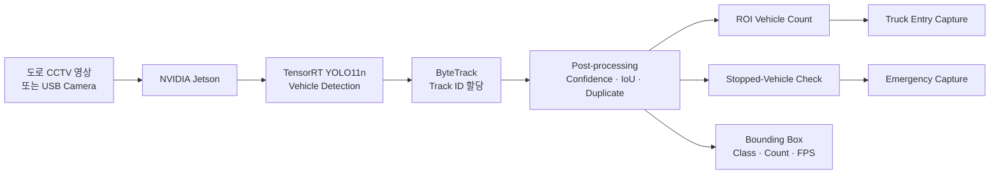
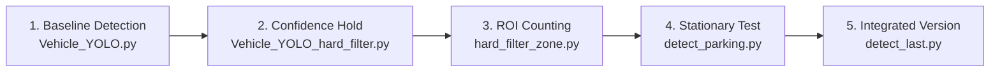
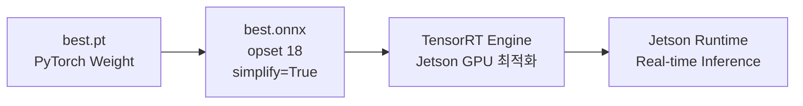
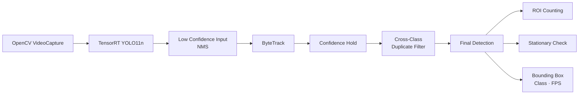
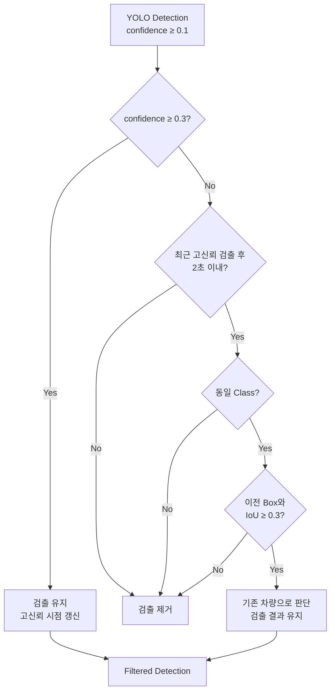
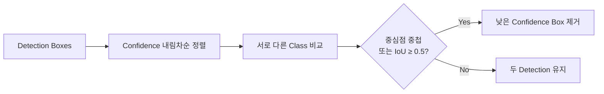
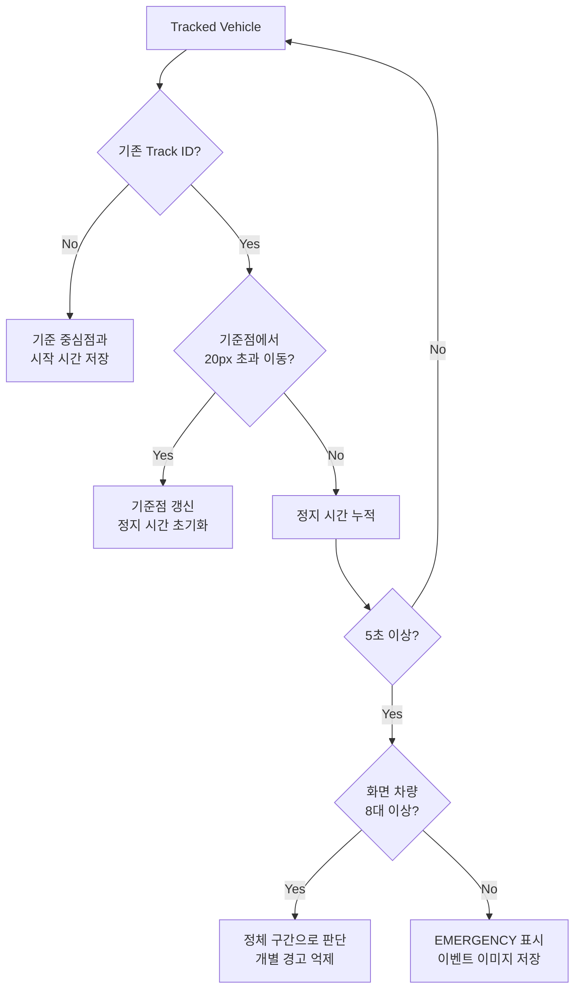

# YOLO Vehicle Detection on Jetson

YOLO11n으로 5종 차량을 학습하고 TensorRT Engine으로 변환하여 NVIDIA Jetson에서 실시간 추론한 Edge AI 팀 프로젝트입니다.

Roboflow 데이터셋을 YOLO 형식으로 변환하고 Fine-tuning을 진행했으며, 검출 결과에 Confidence Hold, 클래스 중복 제거, ByteTrack 추적, ROI 차량 집계와 정차 이벤트 판정을 결합했습니다.

## Key Features

- Truck, Trailer, Bus, Car, Motorcycle 5종 차량 검출
- Roboflow 데이터 수집 및 YOLO Dataset 변환
- YOLO11n Fine-tuning 및 TensorRT Engine 변환
- ByteTrack 기반 프레임 간 차량 추적
- Confidence·IoU 기반 검출 유지 필터
- 서로 다른 클래스의 중복 Bounding Box 제거
- 사용자 지정 ROI의 차량 종류별 누적 집계
- 일정 시간 움직임이 적은 차량의 정차 이벤트 판정
- Truck 진입 및 정차 이벤트 이미지 자동 저장
- 차량 수, Tracking 결과와 FPS 실시간 표시

## Development Environment

| 구분 | 사용 환경 |
|---|---|
| Dataset | Roboflow Vehicle Dataset |
| Training | Google Colab, Python, Ultralytics YOLO11n |
| Model Format | PyTorch Weight → ONNX → TensorRT Engine |
| ONNX Export | Opset 18, `simplify=True` |
| Target Device | NVIDIA Jetson Edge Board |
| GPU Acceleration | CUDA, cuDNN, TensorRT |
| Runtime | Python, OpenCV, NumPy, Ultralytics |
| Tracking | ByteTrack |
| Input | USB Camera 또는 CCTV 영상 |
| Model Input Size | 640 |
| Output | Bounding Box, Class, Track ID, Count, FPS |
| Event Storage | JPEG Screenshot |

> CUDA, cuDNN과 TensorRT는 Jetson 환경에 따라 호환되는 버전을 사용해야 합니다. TensorRT Engine도 대상 장치에서 다시 생성해야 할 수 있습니다.

## System Overview



카메라 프레임은 Jetson에서 TensorRT Engine으로 추론합니다. 검출 결과에 Tracking과 후처리 필터를 적용한 뒤, ROI 집계와 정차 판정 결과를 화면에 표시하고 이벤트 이미지를 저장합니다.

## Dataset Acquisition and Preparation

Roboflow에서 고속도로·국도·도심 도로 등 다양한 배경과 차량이 포함된 Dataset을 가져와 사용했습니다.

원본 Annotation을 확인한 뒤 최종 검출 목적에 맞게 5종 차량 Class로 구성하고, YOLO 학습 형식으로 변환했습니다.

### Dataset Processing Flow

```mermaid
flowchart LR
    ROBO["Roboflow Dataset<br/>Vehicle_500"] --> CHECK["이미지·Annotation 확인"]
    CHECK --> SPLIT["Train / Valid / Test 분류"]
    SPLIT --> BOX["원본 Bounding Box<br/>x1, y1, x2, y2"]
    BOX --> CONVERT["YOLO 좌표 변환<br/>cx, cy, w, h"]
    CONVERT --> NORMAL["0~1 범위 정규화"]
    NORMAL --> CLASS["5종 Class Mapping"]
    CLASS --> YAML["data.yaml 생성"]
    YAML --> VERIFY["Label 위치·Class 검수"]
    VERIFY --> TRAIN["YOLO11n Training"]
```



### YOLO Dataset Structure

```text
dataset/
├─ images/
│  ├─ train/
│  ├─ valid/
│  └─ test/
├─ labels/
│  ├─ train/
│  ├─ valid/
│  └─ test/
└─ data.yaml
```

원본 좌표 `(x1, y1, x2, y2)`는 Bounding Box의 중심점과 크기를 나타내는 `(cx, cy, w, h)`로 변환한 뒤 이미지 크기를 기준으로 0~1 범위로 정규화했습니다.

### Class Mapping

| Class ID | Label | 검출 대상 |
|---:|---|---|
| 0 | `truck` | 대형 화물차 |
| 1 | `trailer` | 트레일러 |
| 2 | `bus` | 버스 |
| 3 | `car` | 승용차 |
| 4 | `motorcycle` | 이륜차 |

Class ID와 Label은 학습, TensorRT 추론과 후처리 코드에서 동일하게 사용했습니다.

## Development Iterations

기본 차량 검출부터 필터, 구역 집계와 정차 판정까지 기능을 단계적으로 확장했습니다.



| 단계 | 주요 검증 내용 |
|---|---|
| Baseline | TensorRT Engine 로드와 5종 차량 Bounding Box 출력 |
| Confidence Hold | 순간적인 저신뢰 검출로 발생하는 Box 깜빡임 완화 |
| Duplicate Filter | 하나의 차량이 여러 Class로 검출되는 현상 제거 |
| ROI Counting | 지정 구역 진입 차량 집계와 중복 카운트 방지 |
| Stationary Detection | Track ID별 위치 변화와 유지 시간 측정 |
| Integrated Version | Tracking, Filter, ROI, Capture와 화면 표시 통합 |

## Model Training

YOLO11n 사전 학습 모델을 기반으로 5종 차량 Dataset을 Fine-tuning했습니다.

| 항목 | 설정 |
|---|---|
| Base Model | `YOLO11n.pt` |
| Number of Classes | 5 |
| Epochs | 250 |
| Batch Size | 16 |
| Image Size | 640 |
| Rotation | `degrees=5.0` |
| Horizontal Flip | `fliplr=0.5` |
| Mosaic | `mosaic=1.0` |
| Best Weight | `best.pt` |

## Training Results

250 Epoch 학습을 수행했으며, 학습 초기에 Loss가 빠르게 감소하고 후반에는 안정적으로 수렴하는 흐름을 확인했습니다.

| Metric | Result |
|---|---:|
| Best mAP50 | `0.9132` |
| Best Epoch | `148` |
| Final mAP50 | `0.884` |
| Final mAP50-95 | `0.608` |
| Precision | `0.844` |
| Recall | `0.841` |
| Final Box Loss | `0.537` |
| Final Classification Loss | `0.3912` |
| Final DFL Loss | `0.8298` |
| Training Time | 약 `0.582시간` |

가장 높은 Validation mAP50가 기록된 Epoch 148의 Weight를 최적 모델로 판단했으며, 후반 Epoch에서도 mAP50가 약 0.88~0.90 범위로 유지되는 것을 확인했습니다.

## TensorRT Conversion



Google Colab에서 학습한 `best.pt`를 ONNX로 변환하고, Jetson 환경에서 TensorRT Engine을 생성했습니다.

TensorRT Engine은 생성한 GPU와 TensorRT 버전에 종속될 수 있으므로, 다른 장치에서는 ONNX 파일을 이용해 Engine을 재생성해야 합니다.

## Runtime Architecture



### Runtime Configuration

| 항목 | 최종 스크립트 설정 |
|---|---:|
| Camera Index | `0` |
| Requested Camera Size | `1000 × 720` |
| Camera Buffer Size | `1` |
| Model Input Size | `640` |
| Tracker | `ByteTrack` |
| Low Confidence | `0.1` |
| High Confidence | `0.3` |
| NMS IoU | `0.45` |
| Hold Time | `2초` |
| Hold Matching IoU | `0.3` |
| Cross-Class IoU | `0.5` |

초기 시연 환경에서는 640×480 Camera Frame을 사용했고, 최종 통합 스크립트에서는 카메라에 1000×720 해상도를 요청하도록 구성했습니다. 실제 입력 해상도는 카메라 지원 사양에 따라 달라질 수 있습니다.

## Confidence Hold Filter

한 프레임에서 Confidence가 낮아졌다는 이유만으로 Bounding Box가 즉시 사라지지 않도록 최근 검출 정보를 일정 시간 유지합니다.



- Confidence `0.3` 이상: 고신뢰 검출로 즉시 유지
- Confidence `0.1~0.3`: 최근 고신뢰 검출과 비교
- 동일 Class, IoU `0.3` 이상, 2초 이내: 이전 차량으로 판단
- 조건 불충족: Detection 제거

이를 통해 일시적인 가림이나 조명 변화로 발생하는 Bounding Box 깜빡임을 줄였습니다.

## Cross-Class Duplicate Filter

하나의 차량이 `car`, `truck`, `bus` 등 여러 Class로 동시에 검출되는 경우 가장 높은 Confidence의 Box 하나만 유지합니다.



동일 Class끼리는 이 필터에서 제거하지 않으며, 서로 다른 Class가 같은 위치에 중복된 경우에만 적용합니다.

## Region-of-Interest Counting

실행 화면에서 마우스로 네 점을 클릭해 차량 집계 영역을 설정합니다.

- 네 점을 연결해 다각형 ROI 생성
- Bounding Box 중심점이 ROI 안에 있는지 확인
- ByteTrack `track_id`를 기준으로 신규 차량만 집계
- 동일 차량이 영역 안에 있는 동안 중복 집계 방지
- 추적이 잠시 끊겨도 3초 동안 기존 Track 정보 유지
- Truck이 새로 진입하면 해당 프레임 자동 저장

### ROI and First-Lane Truck Detection


노란색 다각형으로 차선 영역을 설정하고, Bounding Box 중심점이 영역 안에 들어온 차량을 Class별로 누적합니다.

## Stopped-Vehicle Detection

Track ID별로 차량의 기준 중심점과 정지 시작 시간을 기록합니다.

| 항목 | 판정 기준 |
|---|---:|
| Stationary Time | `5초 이상` |
| Movement Tolerance | 기준점으로부터 `20px 이하` |
| Lost Track Timeout | `5초` |
| Congestion Suppression | 화면 차량 `8대 이상` |



### Stopped-Vehicle Detection Result

<div align="center">
  
</div>

각 차량의 Track ID와 중심 좌표를 기준으로 정지 시간을 누적하고, 조건을 만족한 차량을 빨간색 `EMERGENCY` Box로 표시했습니다.

위 결과는 정차 판정 로직을 검증하기 위해 입력 영상을 일시정지하여 차량 좌표가 일정 시간 유지되는 상황을 재현한 것입니다. 실제 도로 환경에서의 불법 주정차 판정을 의미하지 않습니다.

## Event Capture

| 이벤트 | 저장 위치 | 동작 |
|---|---|---|
| Truck ROI 진입 | `truck_screenshots/` | 신규 Truck 진입 시 한 번 저장 |
| Stopped Vehicle | `captures/` | 정차 이벤트 최초 발생 시 한 번 저장 |

파일명에는 차량 Class, Track ID 또는 누적 Truck 수와 이벤트 발생 시각을 포함합니다.

## Demo

### Highway Vehicle Detection

<div align="center">
  
</div>

TensorRT 추론 결과에 ByteTrack, Confidence Hold, Cross-Class Duplicate Filter와 ROI 집계를 적용한 동작 영상입니다.

## Project Structure

```text
src/
├─ Vehicle_YOLO.py
│  └─ TensorRT YOLO 기본 검출
├─ Vehicle_YOLO_hard_filter.py
│  └─ Confidence Hold와 중복 제거
├─ Vehicle_YOLO_hard_filter_zone.py
│  └─ ROI 집계와 정차 판정 확장
├─ Vehicle_YOLO_detect_parking.py
│  └─ 정차 검출 실험 버전
└─ Vehicle_YOLO_detect_last.py
   └─ Tracking, ROI, 정차 판정과 Capture 통합

docs/
├─ images/
│  └─ stopped_vehicle_detection.png
└─ presentation/
   └─ KCCI_OnDevice_결과보고서(1팀) (1).pptx

requirements.txt
```

## Setup

```bash
python -m venv .venv
```

Windows PowerShell:

```powershell
.venv\Scripts\Activate.ps1
pip install -r requirements.txt
```

Linux:

```bash
source .venv/bin/activate
pip install -r requirements.txt
```

TensorRT는 대상 Jetson의 CUDA와 cuDNN 환경에 맞게 별도로 설치해야 합니다.

## Model Preparation

ONNX와 TensorRT Engine은 파일 용량과 환경 호환성을 고려해 Git 저장소에서 제외했습니다.

호환되는 Engine을 로컬에 배치하고 실행 스크립트의 `ENGINE_PATH`를 설정합니다.

```python
ENGINE_PATH = (
    Path(__file__).resolve().parent
    / "vehicle5_yolo11n_v500_e250.engine"
)
```

TensorRT Engine이 호환되지 않는 경우 ONNX 모델로부터 대상 Jetson 환경에 맞는 Engine을 다시 생성해야 합니다.

## Run

```bash
python src/Vehicle_YOLO_detect_last.py
```

실행 후:

- 화면을 네 번 클릭해 ROI 설정
- `q`를 눌러 종료
- Truck 진입 이미지는 `truck_screenshots/`에서 확인
- 정차 이벤트 이미지는 `captures/`에서 확인

## Notes

- Runtime FPS는 프레임 처리 시간을 기준으로 실시간 계산합니다.
- FPS는 Jetson 모델, TensorRT 버전, 카메라 해상도와 Engine 설정에 따라 달라집니다.
- 정차 판정은 Track ID, 중심 좌표 이동량과 유지 시간을 이용한 규칙 기반 이벤트 검출입니다.
- 본 프로젝트는 교통 단속이나 안전 판단에 바로 사용하는 상용 판정 시스템을 의미하지 않습니다.

## Original Artifact

- [결과보고서 발표자료](<./docs/presentation/KCCI_OnDevice_결과보고서(1팀) (1).pptx>)
